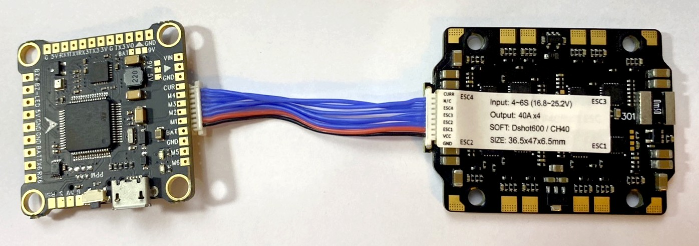

# Flightcontroller F450 quadrocopter

We use a Omnibus F4 V3S Plus flightcontroller, but it is a copy created by LANRC. For Betaflight flash it uses the OmnibusF4SD firmware.

It has a 8pin JST SH 1mm connector, that is compatible with the 8pin connector used by Diatone Mamba Stacks. Except for the current pin.

With the provided 8pin cable I only had to switch pin 7 (CUR) and 8 (GND) on the FC to match the 7 (NC) and 8 (CUR) on the ESC. And that is how the actual connection looks like this

