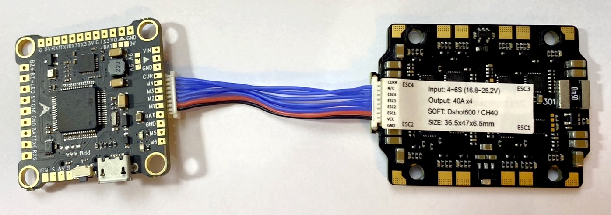
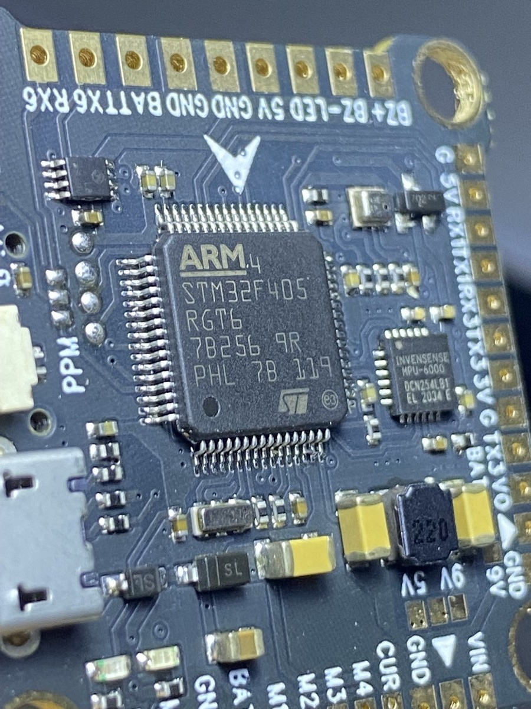

# rc

Remote controlled objects like quadrocopter, rover and robot arms.

## Quadrocopter F450

First DIY with Omnibus F4, Mamba F40, 2216 1100 kV to be used autonomous with Beitan BN880 and Ardupilot.

